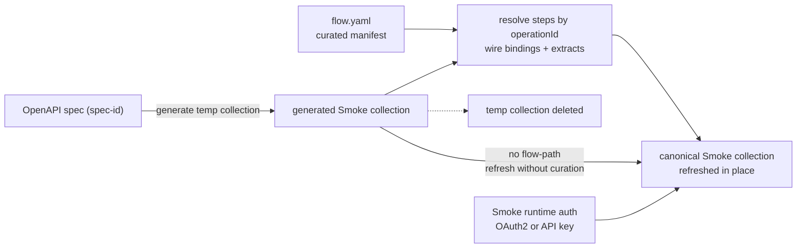

# Postman Onboarding: Smoke Flow

[](https://github.com/postman-cs/postman-smoke-flow-action/actions/workflows/ci.yml) [](https://github.com/postman-cs/postman-smoke-flow-action/releases) [](https://www.npmjs.com/package/@postman-cse/onboarding-smoke-flow) [](LICENSE)

Reshapes the generated Postman Smoke collection to match a curated `flow.yaml`, with optional runtime auth injection for [OAuth2](https://learning.postman.com/docs/use/send-requests/authorization/oauth-20/) and API keys.

Part of the [Postman API Onboarding suite](https://github.com/postman-cs/postman-api-onboarding-action); the composite action's README has the full [action-picker table](https://github.com/postman-cs/postman-api-onboarding-action#which-action-should-i-use).

- [Usage](#usage)
- [Examples](#examples)
- [Inputs](#inputs) / [Outputs](#outputs)
- [How it works](#how-it-works)
- [Credentials and regions](#credentials-and-regions)

## Usage

```yaml
jobs:
  smoke-flow:
    runs-on: ubuntu-latest
    # The Postman API has no cross-process lease for collection edits.
    concurrency:
      group: postman-smoke-flow-${{ vars.POSTMAN_SMOKE_COLLECTION_ID }}
      cancel-in-progress: false
    steps:
      - uses: actions/checkout@v5

      - id: postman_token
        uses: postman-cs/postman-resolve-service-token-action@v2
        with:
          postman-api-key: ${{ secrets.POSTMAN_API_KEY }}
          postman-region: us

      - uses: postman-cs/postman-smoke-flow-action@v2
        with:
          project-name: core-payments
          workspace-id: ${{ vars.POSTMAN_WORKSPACE_ID }}
          spec-id: ${{ vars.POSTMAN_SPEC_ID }}
          smoke-collection-id: ${{ vars.POSTMAN_SMOKE_COLLECTION_ID }}
          flow-path: .postman-api-launchpad/flows/core-payments/flow.yaml
          spec-path: api/openapi.yaml
          postman-access-token: ${{ steps.postman_token.outputs.token }}
          postman-region: us
```

`postman-access-token` is the required credential: the Smoke collection reshape runs entirely through the Postman gateway under that token. Mint it with [`postman-resolve-service-token-action`](https://github.com/postman-cs/postman-resolve-service-token-action), as shown above. `postman-api-key` is optional and only re-mints the access token if it expires mid-run; it never drives the reshape.

The workspace, spec, and Smoke collection IDs normally come straight from a `postman-bootstrap-action` step in the same job (see the chained pipeline example below).
For EU data residency, set `postman-region: eu` on bootstrap, Smoke Flow, and repo sync so every step calls the same Postman region.

## Examples

### Chained bootstrap -> smoke-flow -> repo-sync pipeline

This action is designed to run directly after `postman-bootstrap-action` and before `postman-repo-sync-action`:

```yaml
jobs:
  onboarding:
    runs-on: ubuntu-latest
    # This fixed project key is available before steps run. Do not use a
    # same-job bootstrap step output in job-level concurrency.
    concurrency:
      group: postman-onboarding-core-payments
      cancel-in-progress: false
    steps:
      - uses: actions/checkout@v5

      - id: postman_token
        uses: postman-cs/postman-resolve-service-token-action@v2
        with:
          postman-api-key: ${{ secrets.POSTMAN_API_KEY }}
          postman-region: us

      - id: bootstrap
        uses: postman-cs/postman-bootstrap-action@v2
        with:
          project-name: core-payments
          spec-url: https://raw.githubusercontent.com/postman-cs/postman-smoke-flow-action/main/examples/core-payments-openapi.yaml
          postman-region: us
          postman-api-key: ${{ secrets.POSTMAN_API_KEY }}
          postman-access-token: ${{ steps.postman_token.outputs.token }}

      - id: smoke_flow
        uses: postman-cs/postman-smoke-flow-action@v2
        with:
          project-name: core-payments
          workspace-id: ${{ steps.bootstrap.outputs.workspace-id }}
          spec-id: ${{ steps.bootstrap.outputs.spec-id }}
          smoke-collection-id: ${{ steps.bootstrap.outputs.smoke-collection-id }}
          flow-path: .postman-api-launchpad/flows/core-payments/flow.yaml
          postman-access-token: ${{ steps.postman_token.outputs.token }}
          postman-region: us

      - id: repo_sync
        uses: postman-cs/postman-repo-sync-action@v2
        with:
          project-name: core-payments
          workspace-id: ${{ steps.bootstrap.outputs.workspace-id }}
          baseline-collection-id: ${{ steps.bootstrap.outputs.baseline-collection-id }}
          smoke-collection-id: ${{ steps.smoke_flow.outputs.smoke-collection-id }}
          contract-collection-id: ${{ steps.bootstrap.outputs.contract-collection-id }}
          environments-json: '["prod"]'
          env-runtime-urls-json: '{"prod":"https://api.example.com"}'
          postman-region: us
          postman-api-key: ${{ secrets.POSTMAN_API_KEY }}
          postman-access-token: ${{ steps.postman_token.outputs.token }}
          team-id: ${{ steps.postman_token.outputs.team-id }}
```

### Apply a curated flow.yaml

With `flow-path` set, the action generates a temporary Smoke collection from the current spec, reshapes it to match the curated flow, injects [pre-request](https://learning.postman.com/docs/tests-and-scripts/write-scripts/pre-request-scripts/) and [test scripts](https://learning.postman.com/docs/tests-and-scripts/write-scripts/test-scripts/) from bindings and extracts, updates the canonical Smoke collection in place, and deletes the temporary collection. The manifest format is documented in [docs/flow-manifest.md](docs/flow-manifest.md). The exact pre-request and test scripts injected per step are documented in [docs/generated-tests.md](docs/generated-tests.md), with a committed example manifest at [examples/flow.yaml](examples/flow.yaml).

```yaml
- uses: postman-cs/postman-smoke-flow-action@v2
  with:
    project-name: core-payments
    workspace-id: ${{ steps.bootstrap.outputs.workspace-id }}
    spec-id: ${{ steps.bootstrap.outputs.spec-id }}
    smoke-collection-id: ${{ steps.bootstrap.outputs.smoke-collection-id }}
    postman-region: us
    flow-path: .postman-api-launchpad/flows/core-payments/flow.yaml
    spec-path: api/openapi.yaml
    postman-access-token: ${{ steps.postman_token.outputs.token }}
```

### OAuth update without flow-path

To add Smoke-only [OAuth2](https://learning.postman.com/docs/use/send-requests/authorization/oauth-20/) client-credentials token acquisition before a `flow.yaml` exists, omit `flow-path` and enable OAuth in the onboarding config that wraps this action. The workflow still generates a temporary Smoke collection from the spec, refreshes the canonical Smoke collection from that generated collection, and then applies OAuth without adding flow scripts, bindings, extracts, or curated ordering. Full configuration options are in [docs/smoke-oauth.md](docs/smoke-oauth.md).

```yaml
smoke:
  apiKey:
    enabled: false
  oauth:
    enabled: true
    tokenUrl: "https://auth.example.com/oauth/token"
    scope: "read write"
    clientIdSecret: OAUTH_CLIENT_ID
    clientSecretSecret: OAUTH_CLIENT_SECRET
```

### API key update without flow-path

To add Smoke-only API key auth before a `flow.yaml` exists, omit `flow-path` and enable API key auth in the onboarding config that wraps this action. The workflow still generates a temporary Smoke collection from the spec, refreshes the canonical Smoke collection from that generated collection, and then applies API key auth without adding flow scripts, bindings, extracts, or curated ordering. The action writes a placeholder variable only; inject the real API key when the Smoke collection runs. Full configuration options are in [docs/smoke-api-key.md](docs/smoke-api-key.md).

```yaml
smoke:
  apiKey:
    enabled: true
    in: header
    name: X-API-Key
    variableName: service_api_key
    valueSecret: TARGET_API_KEY
  oauth:
    enabled: false
```

### Debug the transformed collection with debug-dump-path

Set `debug-dump-path` to write the transformed collection JSON to disk before the update call, then upload it as a workflow artifact for inspection:

```yaml
- uses: postman-cs/postman-smoke-flow-action@v2
  with:
    project-name: core-payments
    workspace-id: ${{ steps.bootstrap.outputs.workspace-id }}
    spec-id: ${{ steps.bootstrap.outputs.spec-id }}
    smoke-collection-id: ${{ steps.bootstrap.outputs.smoke-collection-id }}
    postman-region: us
    flow-path: .postman-api-launchpad/flows/core-payments/flow.yaml
    debug-dump-path: smoke-collection-debug.json
    keep-temp-collection-on-failure: "true"
    postman-access-token: ${{ steps.postman_token.outputs.token }}

- if: always()
  uses: actions/upload-artifact@v4
  with:
    name: smoke-collection-debug
    path: smoke-collection-debug.json
```

### Run from non-GitHub CI with the CLI

The npm package ships a `postman-smoke-flow` binary that accepts every action input as the same kebab-case flag and prints the action outputs as JSON to stdout:

```sh
npx --package @postman-cse/onboarding-smoke-flow postman-smoke-flow \
  --project-name core-payments \
  --workspace-id "$POSTMAN_WORKSPACE_ID" \
  --spec-id "$POSTMAN_SPEC_ID" \
  --smoke-collection-id "$POSTMAN_SMOKE_COLLECTION_ID" \
  --flow-path .postman-api-launchpad/flows/core-payments/flow.yaml \
  --postman-region eu \
  --postman-access-token "$POSTMAN_ACCESS_TOKEN"
```

See [docs/cli.md](docs/cli.md) for GitLab CI, Bitbucket Pipelines, Azure DevOps, and Jenkins patterns.

## Inputs

<!-- inputs-table:start -->
| Name | Description | Required | Default |
| --- | --- | --- | --- |
| `project-name` | Service project name used for temporary smoke collection naming. | yes |  |
| `workspace-id` | Postman workspace ID produced by bootstrap. | yes |  |
| `spec-id` | Postman spec ID produced by bootstrap. | yes |  |
| `smoke-collection-id` | Canonical Smoke collection ID to refresh in place. | yes |  |
| `flow-path` | Optional repo-root-relative path to the curated flow.yaml manifest. When omitted, the canonical Smoke collection is refreshed from the generated spec collection without flow curation. | no |  |
| `postman-api-key` | Optional service-account API key. Only used to re-mint an expired postman-access-token; the collection reshape itself runs access-token-only through the Postman gateway. | no |  |
| `postman-region` | Postman data residency region for public API calls. Supported values are us and eu. | no | `us` |
| `auth-config-json` | Advanced low-level Smoke runtime auth JSON, usually generated by onboarding templates from smoke.apiKey or smoke.oauth config. Supports OAuth2 client credentials and API key auth. | no |  |
| `secrets-resolver-enabled` | Whether to include the legacy AWS Secrets Manager resolver item at the start of the generated Smoke collection. Defaults to true for backward compatibility; set to false to opt out. | no | `true` |
| `spec-path` | Optional repo-root-relative path to the local OpenAPI spec for validation and debug context. | no |  |
| `debug-dump-path` | Optional repo-root-relative or absolute path to write the transformed collection JSON before update. | no |  |
| `collection-sync-mode` | Collection lifecycle policy. Refresh is the supported v1 mode. | no | `refresh` |
| `postman-access-token` | Service-account access token (x-access-token) that authenticates the Smoke collection reshape against the Postman gateway. Required for the reshape; when omitted, the action mints one from postman-api-key (service-account PMAK). | no |  |
| `fail-on-flow-warning` | Whether non-blocking flow warnings should fail the action. | no | `false` |
| `keep-temp-collection-on-failure` | Whether to keep the generated temporary smoke collection for debugging after a failed apply. | no | `false` |
| `temp-collection-prefix` | Prefix used when generating the temporary smoke collection from the spec. | no | `[Smoke][Temp]` |
| `team-id` | Optional Postman team ID, used only to attribute non-identifying usage telemetry to your team. The action runs identically with or without it. | no |  |
<!-- inputs-table:end -->

## Outputs

<!-- outputs-table:start -->
| Name | Description |
| --- | --- |
| `smoke-collection-id` | Canonical Smoke collection ID after curated flow application. |
| `flow-apply-status` | Flow apply result status. |
| `flow-apply-summary-json` | JSON summary of flow application results and warnings. |
| `temporary-smoke-collection-id` | Temporary generated smoke collection ID used during apply. |
| `flow-step-count` | Number of steps in the applied flow. |
| `resolved-operation-count` | Number of flow steps resolved to generated requests. |
| `applied-binding-count` | Number of bindings applied as prerequest logic. |
| `applied-extract-count` | Number of extracts applied as test logic. |
| `assertion-count` | Number of generated assertions applied across flow steps. |
<!-- outputs-table:end -->

## How it works



In flow mode (`flow-path` set), the action reads the curated manifest, generates a temporary Smoke collection from the spec, resolves each flow step against the generated requests by `operationId` (with an optional method-plus-path fallback when `spec-path` is provided), wires bindings and extracts into pre-request and test scripts, refreshes the canonical Smoke collection in place, and removes the temporary collection. The manifest schema and resolution rules are in [docs/flow-manifest.md](docs/flow-manifest.md).

In no-flow mode (`flow-path` omitted), the action still generates a temporary Smoke collection from the spec and refreshes the canonical Smoke collection from that generated collection. If Smoke runtime auth is configured, it applies that auth during the refresh. It does not add flow scripts, bindings, extracts, or curated ordering. OAuth2 client credentials are documented in [docs/smoke-oauth.md](docs/smoke-oauth.md), and API key auth is documented in [docs/smoke-api-key.md](docs/smoke-api-key.md).

All collection operations — generating the temporary collection from the spec, reading it, reshaping the canonical collection, and deleting the temporary one — run through the Postman gateway under postman-access-token. The action never mutates baseline or contract collections, and it never writes runtime tokens or client secrets back to Postman environments.

The action validates that the canonical collection belongs to `workspace-id`, assigns each temporary collection a run-unique identity, and deletes only the temporary ID it positively adopts. Unsafe create POSTs are submitted once and reconciled after statusless transport failures, HTTP 408/429, or 5xx responses. Postman does not expose a cross-process collection lease or create idempotency key, so workflows that can overlap must use a concurrency group keyed by `smoke-collection-id`, as shown in the Usage example. Job-level concurrency is evaluated before steps run, so a chained bootstrap workflow must use a pre-existing variable, reusable-workflow input, or fixed project key—not a same-job step output. This serializes cooperating CI runs; unrelated writers that ignore the key remain a residual risk.

## Credentials and regions

| Need | Recommended path |
| --- | --- |
| Generate, read, reshape, and delete the Smoke collection | Pass postman-access-token. The reshape runs entirely through the Postman gateway under this token, so it is required. Mint it with postman-resolve-service-token-action. |
| Re-mint the access token if it expires mid-run | Optionally pass postman-api-key from a GitHub Actions secret or CI secret. It is used only to refresh an expired postman-access-token and never drives an asset operation. |
| Service-account access token and team ID for the broader onboarding pipeline | Run postman-resolve-service-token-action before bootstrap or the composite action, and reuse its token output across steps. |
| Smoke collection runtime auth | Keep OAuth client credentials or target API keys in CI secrets or runtime variables. This action writes placeholders only. |

postman-region selects the Postman public API host used to re-mint the access token and to run the identity preflight: us for https://api.getpostman.com and eu for https://api.eu.postman.com. The default is us. Use the same region as bootstrap and repo sync.

## Resources

- npm package: [@postman-cse/onboarding-smoke-flow](https://www.npmjs.com/package/@postman-cse/onboarding-smoke-flow)
- Docs in this repo: [flow.yaml manifest format](docs/flow-manifest.md), [Smoke OAuth configuration](docs/smoke-oauth.md), [Smoke API key configuration](docs/smoke-api-key.md), [generated tests](docs/generated-tests.md), [CLI usage for non-GitHub CI](docs/cli.md)
- Marketplace docs: [Support](SUPPORT.md), [Security policy](SECURITY.md), [Release policy](RELEASE_POLICY.md), [Contributing](CONTRIBUTING.md)
- Postman scripting references: [OAuth 2.0](https://learning.postman.com/docs/use/send-requests/authorization/oauth-20/), [pre-request scripts](https://learning.postman.com/docs/tests-and-scripts/write-scripts/pre-request-scripts/), [test scripts](https://learning.postman.com/docs/tests-and-scripts/write-scripts/test-scripts/), [pm variables](https://learning.postman.com/docs/tests-and-scripts/write-scripts/postman-sandbox-reference/pm-variables/)

## Telemetry

The action sends one anonymous usage event per run (action name/version, outcome, coarse CI metadata; never secrets, spec content, or repo names), and only when the optional `team-id` input is set. Disable with `POSTMAN_ACTIONS_TELEMETRY=off` or `DO_NOT_TRACK=1`; route events to your own collector with `POSTMAN_ACTIONS_TELEMETRY_ENDPOINT`.

## License

[MIT](LICENSE)
